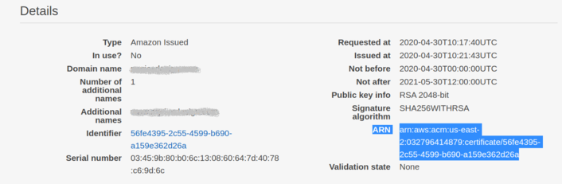

# Progressive Web Application Pipeline

## Overview

This template creates a fully automated Gatsby.js pipeline, hosted on AWS S3 served over CloudFront CDN. The application is accessible over a secure SSL connection with your hostname.

### Main Features

- :star: Progressive Web Application application hosted on AWS S3
- :star: Application served on a worldwide CDN with AWS CloudFront
- :star: Secure connection with SSL certificate on AWS Route 53
- :star: Redirect all http://www.domain.com traffic to https://domain.com
- :star: AWS CodePipeline which automates application deployment

### You should already have following (if not follow the how to's):

- :warning: Route 53 Hosted Domain
- :rotating_light: SSL Certificate ARN (AWS Certificate Manager) - the certificate must be in the **US East (N. Virginia)us-east-1** region
- :warning: GitHub OAuth Token

#### [How to's](#how-to)

**Note**:

Do not include the public directory in the repo

## Launch the stack

If you have all the resource needed, launch the stack below (I suggest right click and open it in a new tab):

### The following resources will be created

- S3 Bucket - Main Site
- S3 Bucket - Redirect www to non-www
- S3 Bucket - Pipeline bucket
- CloudFront CDN
- Route 53 Record set - Both root domain and www subdomain
- CloudFront CDN
- CodePipeline
- Route53 Record Sets
- IAM Roles and Policies

If you do not have a Gatsby application, clone this repo

    git clone git@github.com:subaquatic-pierre/pwa-pipeline.git

## How to:

- [Route 53 hosted Domain](#route-53)
- [SSL Certificate associated with that domain](#ssl-certificate)
- [GitHub repository which contains a gatsby website](#repo)
- [GitHub OAuth Token](#github-oauth-token)

### Route 53

Create a hosted domain in Route53

[https://console.aws.amazon.com/route53](https://console.aws.amazon.com/route53)

1. If you don't already have a domain registered with another registrar, you will first need to register a domain. This can be done in the main Route53 dashboard, it can take up to 24 hours for domain to be active
2. If you have a domain hosted with another registrar, click on "Hosted zones" on the sidebar
3. Click create hosted zones - you will then have a hosted zone with 2 record sets, NS and SOA records
4. If you have a domain registered with another registrar, add AWS NS servers to current hosted domain, depending on provider you will have to follow their instructions to point your domain to AWS Route 53

### SSL Certificate

Create an SSL certificate, follow the link to the Certificate Manager Console

[https://console.aws.amazon.com/acm](https://console.aws.amazon.com/acm)

Note: **Be sure to create the certificate within "US East (N. Virginia) us-east-1"**

1. Change region to **US East (N. Virginia) us-east-1**
2. Click -> "Request a certificate"
3. Check -> "Request a public certificate" and then Click -> "Request a certificate"
4. Enter -> "myexampledomain.com"
5. Click -> "Add another name to this certificate"
6. Enter -> "www.myexampledomain.com" and then Click -> "Next"
7. Check -> "DNS validation" and Click -> "Next"
8. Click -> "Review" and then Click -> "Confirm and request"

Once the certificates are created you will need to add them to the Route53 hosted zone. There are a few ways to do it, the easiest way is to click "Create record in Route 53" under each domain name. This will automatically add the CNAME record to your hosted zone.

Once the certificates are added to your hosted zone, wait a few minutes for the certificates to validate and then click "Continue".

After the certificates are validated, copy the ARN number of the certificate. This will be used as input for the CloudFormation template.

**Copy the ARN of the certificate**

### GitHub

#### Repo

Clone this repo if you don't already have a Gatsby site

    git clone git@github.com:subaquatic-pierre/gatsby-pipeline-app.git

_or_

Create a new Gatsby app with the gatsby CLI and upload it to your own repo

    gatsby new gatsby-site

#### GitHub OAuth Token

You can access your Github tokens with the below link

https://github.com/settings/tokens

or check this help page for more info

https://help.github.com/en/enterprise/2.17/user/github/authenticating-to-github/creating-a-personal-access-token-for-the-command-line
